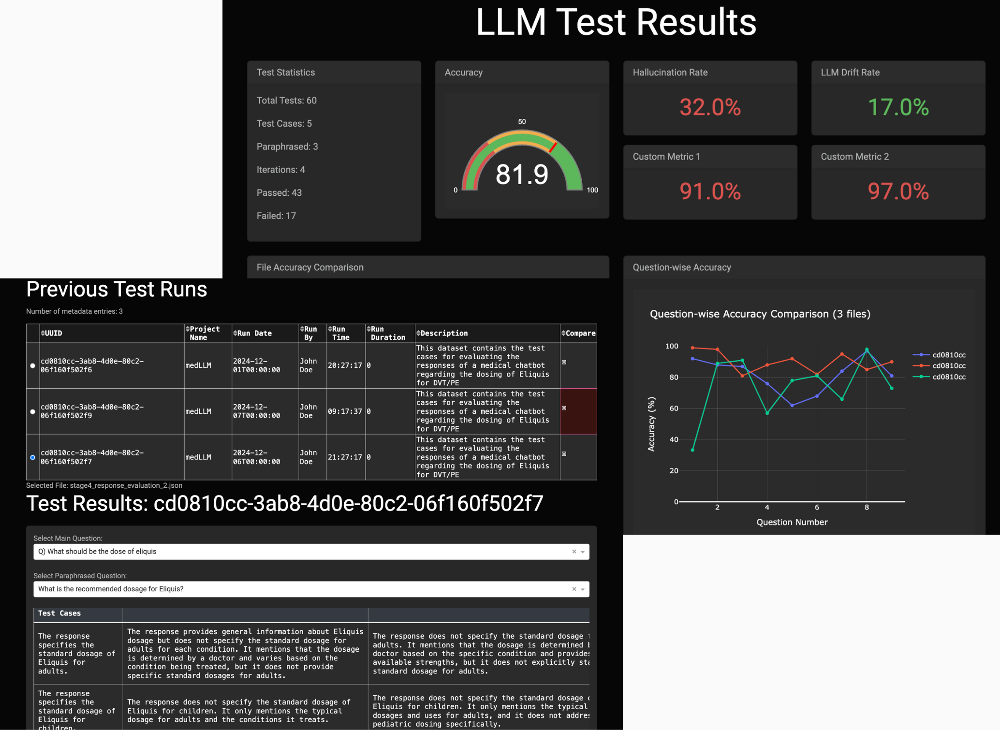

# BreakYourLLM


[](https://www.breakyourllm.com/waitlist)
[](https://www.breakyourllm.com/)
[](https://modelpulse.github.io/BreakYourLLM)
[](https://www.python.org/downloads/release/python-380/)
## Test & Simulate your Production LLMs

**Break Your LLM before your users do! With our framework, you can build a comprehensive suite of tests that rigorously test your LLM against your guidelines.**

## Overview

This is a comprehensive framework designed for testing and evaluating language models, particularly in the field of Natural Language Processing (NLP). This toolset provides functionalities for running tests, calculating performance metrics, and visualizing results to assess the quality of language models.


## Table of Contents

- [Features](#features)
- [Technologies](#technologies)
- [Installation](#installation)
- [Usage](#usage)
- [Codebase Organization](#codebase-organization)
- [Contributing](#contributing)
- [License](#license)

## Features

- **Model Testing**: Execute tests on various language models.
- **Metrics Calculation**: Calculate metrics such as accuracy, hallucination rate, and more.
- **Result Visualization**: Visualize test results for better analysis.
- **Configurable**: Easily configure settings through YAML and environment files.




## Technologies

- **Languages**: Python
- **Frameworks/Libraries**: 
  - OpenAI
  - Pandas
  - NumPy
  - PyYAML
  - Requests
- **Tools**: 
  - Pydantic
  - Python-dotenv

## Installation

To get started with this project, follow these steps:

1. **Clone the repository**:
   ```bash
   git clone https://github.com/yourusername/BreakYourLLM.git
   cd BreakYourLLM

2. **Install the required dependencies**:
    ```bash
    pip install -r requirements.txt
    ```
3. **Configure your environment**:
    ```bash
    Create a .env file based on the provided .env.example and fill in the necessary variables.
    ```

## Usage

To execute tests and evaluate models, run the following command:

```bash
python sources/execute_tests.py
```


To visualize the results, run the dashboard using the following command:
```bash
python sources/dashboard/app.py
```
Note: Run the command from the root repository folder.

Refer to the documentation in the sources/ directory for more detailed usage instructions.


## Codebase Organization
The project is organized as follows:

```bash
BreakYourLLM/
│
├── config/                # Configuration files
│   ├── .env               # Environment variables
│   └── config.yaml        # Configuration settings
│
├── sources/               # Source code
│   ├── execute_tests.py    # Script for executing tests
│   ├── full_pipeline.py     # Full testing pipeline script
│   ├── helpers/            # Helper scripts
│   ├── metrics/            # Metrics calculation modules
│   ├── models/             # Model-related modules
│   └── views/              # Result visualization modules
│   └── dashboard/          # Dashboard for visualizing results
│       ├── app.py          # Main application file
│       ├── components/     # Components for the dashboard
│       └── callbacks/      # Callbacks for the dashboard
│
└── requirements.txt       # Project dependencies
```

## Contributing

We welcome contributions! Please follow these steps:

1. Fork the repository.
2. Create a new branch (git checkout -b feature/YourFeature).
3. Make your changes and commit them (git commit -m 'Add some feature').
4. Push to the branch (git push origin feature/YourFeature).
5. Open a pull request.


